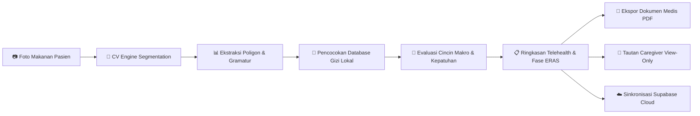

<div align="center">

```
 _   _ _   _ _____ ____  _____     _____ ____ ___ ___  _   _      _    ___ 
| \ | | | | |_   _|  _ \|_ _\ \   / /_ _/ ___|_ _/ _ \| \ | |    / \  |_ _|
|  \| | | | | | | | |_) || | \ \ / / | |\___ \| | | | |  \| |   / _ \  | | 
| |\  | |_| | | | |  _ < | |  \ V /  | | ___) | | |_| | |\  |  / ___ \ | | 
|_| \_|\___/  |_| |_| \_\___|  \_/  |___|____/___\___/|_| \_| /_/   \_\___|
```

### 🥗 **Nutrisi Presisi Klinis Berbasis AI & Telehealth Pemulihan Pasca-Operasi (ERAS)**

[](https://syifamojocanggih-hash.github.io/Nutrivision_AI/)
[](https://syifamojocanggih-hash.github.io/Nutrivision_AI/)
[](https://syifamojocanggih-hash.github.io/Nutrivision_AI/)
[](https://supabase.com)
[](https://syifamojocanggih-hash.github.io/Nutrivision_AI/)

<br>

🌐 **Demo Langsung (Live Application):**  
👉 **[https://syifamojocanggih-hash.github.io/Nutrivision_AI/](https://syifamojocanggih-hash.github.io/Nutrivision_AI/)**

</div>

---

## 📖 Tentang NutriVision AI

**NutriVision AI** adalah platform *clinical decision support system* (CDSS) berbasis web dan *Progressive Web App* (PWA) yang memadukan **kecerdasan buatan (*Computer Vision segmentation*)**, **protokol pemulihan bedah ERAS (*Enhanced Recovery After Surgery*)**, serta **ensiklopedia pangan super lokal Nusantara**.

Aplikasi ini mendampingi pasien pasca-operasi, lansia dalam masa pemulihan, atlet rehabilitasi cedera, maupun keluarga pendamping (*caregiver*) untuk memantau pemenuhan target protein dan kalori secara mandiri, aman, dan terukur.

---

## 🌟 Fitur-Fitur Utama

| Fitur Unggulan | Deskripsi & Keunggulan Klinis |
| :--- | :--- |
| 👁️ **Multi-Segment Food CV** | Memindai piring makan, mendeteksi beberapa jenis bahan sekaligus, menandai masking poligon warna-warni, serta mengestimasi rentang makronutrisi (Protein, Karbohidrat, Lemak, Kalori). |
| 🎯 **Macro Rings & Recovery Targets** | Cincin target gizi real-time berbasis profil klinis, berat badan, dan fase regenerasi jaringan (Fase 1 Akut, Fase 2 Proliferasi Albumin, Fase 3 Remodeling). |
| 📄 **Ekspor Dokumen Laporan (PDF)** | Menghasilkan berkas PDF medis formal ukuran A4 lengkap dengan data pasien, tabel kepatuhan 7 hari, riwayat gejala, target ERAS, dan kolom tanda tangan nakes/caregiver. |
| 🥣 **Symptom-Aware Texture Filter** | Menyesuaikan rekomendasi menu berdasarkan keluhan klinis aktif (*Sulit Menelan/Disfagia, Mual, Konstipasi, Nafsu Makan Rendah*) dengan tombol berkontras tinggi (WCAG AAA). |
| 🍱 **Dual-Mode Meal Planner** | Memberikan 2 opsi perencanaan makanan harian: **Opsi Standar (Optimal)** dan **Opsi Hemat (Low-Budget)** berbasis pangan lokal terjangkau. |
| 🐟 **Ensiklopedia Pangan Super Lokal** | Database pangan Indonesia kaya albumin & mikronutrien regeneratif: Ikan Gabus (*Channa striata*), Tempe Kedelai, Telur Bebek/Ayam, Sayur Bening Bayam, dll. |
| 👥 **Caregiver Portal (View-Only)** | Tautan aman satu klik untuk keluarga dan dokter fisioterapis agar dapat memantau asupan pasien tanpa risiko salah ubah data. |
| ♿ **Aksesibilitas & Ramah Lansia** | Pengaturan ukuran font 3-tingkat (A, A+, A++), mode kontras tinggi (*high-contrast*), navigasi bawah jempol (*thumb-friendly*), dan dukungan 100% offline-first. |

---

## 🏗️ Alur Sistem & Arsitektur



---

## 📑 Panduan Penggunaan Aplikasi

### 1. Membuka & Menginstall Aplikasi (PWA)

NutriVision AI dirancang dengan arsitektur **Progressive Web App (PWA)** sehingga dapat dibuka di laptop maupun diinstal langsung ke layar utama smartphone layaknya aplikasi native tanpa Google Play Store atau Apple App Store.

* **Pengguna Android (Google Chrome / Edge):**
  1. Buka [tautan aplikasi](https://syifamojocanggih-hash.github.io/Nutrivision_AI/).
  2. Tekan menu titik tiga (⋮) di pojok kanan atas browser 👉 Pilih **"Instal Aplikasi"** atau **"Tambahkan ke Layar Utama"**.
* **Pengguna iPhone / iPad (Safari):**
  1. Tekan tombol **Bagikan (*Share* / ikon kotak dengan panah ke atas)** di bilah bawah Safari.
  2. Gulir ke bawah lalu pilih **"Tambah ke Layar Utama" (*Add to Home Screen*)**.

---

### 2. Pengaturan Profil Pasien & Diagnostik Gizi

Saat pertama kali digunakan, lengkapi profil pasien untuk perhitungan gramatur gizi personal:

1. Klik tombol **"Mulai Diagnostik Gizi (5 Langkah)"** atau buka tab **Profil**.
2. Masukkan data:
   * **Nama Pasien & Kontak/Email**
   * **Kondisi Klinis:** *Pasca-Operasi Bedah*, *Fisioterapi & Rehabilitasi Cedera*, atau *Pemulihan Kebugaran*.
   * **Fase Pemulihan:** *Fase 1 (Inflamasi & Akut)*, *Fase 2 (Proliferasi & Sintesis)*, atau *Fase 3 (Remodeling)*.
   * **Antropometri:** Berat badan (kg), tinggi badan (cm), dan tingkat mobilisasi harian.
   * **Deklarasi Pantangan / Alergi:** Contoh: *Bebas santan kental, rendah garam, bebas gluten*.
3. Sistem secara otomatis menghitung **Target Protein Harian** (contoh: 65 kg × 1.5g = **98g protein/hari**) dan kebutuhan kalori basal.

---

### 3. Memindai (*Scan*) & Mengenali Piring Makanan

1. Klik tombol **"Scan Makanan Baru"** pada kartu utama atau tekan tombol kamera melayang (**FAB**) di pojok kanan bawah layar HP.
2. Pilih sumber foto:
   * 📷 **Buka Kamera:** Ambil foto piring makanan secara langsung.
   * 📁 **Unggah Berkas:** Pilih foto makanan dari galeri ponsel.
   * ⚡ **Preset Demo:** Pilih hidangan uji cepat (*Sup Ikan Gabus Albumin*, *Tim Ayam Tahu Sayur*, atau *Salmon Recovery Bowl*).
3. Sistem Computer Vision secara instan menyekat (*segmentation*) piring ke dalam komponen bahan makanan dengan visualisasi poligon, menampilkan persentase kecocokan deteksi, serta total estimasi gramatur protein dan kalori.

---

### 4. Menyesuaikan Porsi & Koreksi Bahan Makanan

Jika porsi riil berbeda dari estimasi awal:
* **Ubah Gram Porsi:** Ketik angka gramatur porsi aktual. Nilai nutrisi makro akan dihitung ulang secara real-time.
* **Hapus Bahan:** Tekan ikon tempat sampah (**🗑️**) pada bahan yang tidak dikonsumsi.
* **Tambah Bahan:** Buka tab **Katalog Pangan** lalu klik **"+ Tambah ke Piring"**.
* **Simpan ke Rekam Harian:** Tekan tombol **"Catat Asupan Ini"** untuk memperbarui cincin progres hari ini.

---

### 5. Filter Gejala Adaptif (*Symptom-Aware Filter*)

Pasien pasca-bedah sering mengalami efek samping anestesi atau pembedahan. NutriVision AI menyediakan tombol filter gejala berkontras tinggi (**Deep Forest Matcha, lolos WCAG AAA**):

* 🌊 **Mual:** Menyarankan hidangan berkuah bening suhu ruang / suam-kuku, biskuit jahe tawar, serta menghindari minyak dan santan.
* 💧 **Sulit Menelan / Disfagia:** Menyesuaikan menu ke tekstur lunak halus (*puree* / saring), seperti bubur ikan tim dan puding protein.
* 🛡️ **Konstipasi / Sembelit:** Mengutamakan hidangan berserat larut air (sayur bening bayam, labu siam) dan asupan cairan hangat.
* ✨ **Nafsu Makan Rendah:** Menganjurkan makanan padat nutrisi porsi mini berfrekuensi sering (*small frequent nutrient-dense meals*).

---

### 6. Perencana Menu (*Dual-Mode Meal Planner*)

Pada tab **Menu / Perencana Menu**, Anda dapat beralih antara:
1. **Opsi Standar (Optimal):** Hidangan dengan bahan premium kaya asam amino (Dada Ayam Fillet, Ikan Gabus Segar, Sup Daging Kolagen).
2. **Opsi Hemat (Low-Budget):** Menu padat gizi berbasis pangan lokal terjangkau pasar tradisional (Tempe Bacem, Tahu Kukus, Telur Ayam Rebus, Pepes Kembung).

Setiap kartu menyajikan informasi gramatur protein, estimasi biaya harian (Rp), serta label keunggulan biologis.

---

### 7. Ekspor Dokumen Laporan & Progress ke Format PDF

NutriVision AI menyediakan fitur ekspor rekam medis nutrisi resmi yang siap dicetak atau diserahkan kepada dokter spesialis, fisioterapis, dan perawat:

1. Buka tab **Progres** atau klik **"Ekspor Dokumen PDF"** pada kartu kepatuhan di Dashboard.
2. Jendela **Pratinjau Dokumen Medis Resmi** akan terbuka, menampilkan lembar dokumen A4 berisi:
   * **Kop Dokumen Resmi:** Logo NutriVision AI, nomor referensi telehealth, tanggal & jam terbit.
   * **Data Klinis Pasien:** Nama, diagnosis klinis, fase ERAS, berat badan, tinggi badan, BMI, dan pantangan.
   * **Target Nutrisi Harian:** Kartu target Protein, Kalori, Karbohidrat, dan Lemak.
   * **Tabel Riwayat Kepatuhan 7 Hari:** Rincian hari/tanggal, target, asupan aktual, persentase kepatuhan (dengan mini visual bar), dan status klinis (*Tercapai / Terpantau*) dengan rata-rata 92%.
   * **Rincian Asupan Terkini Hari Ini & Catatan Gejala Aktif.**
   * **Lembar Verifikasi & Kolom Tanda Tangan:** Ruang tanda tangan pasien/caregiver dan dokter spesialis / nakes terdaftar (SIP/STR).
3. Klik tombol **"Unduh PDF"** untuk mengunduh langsung berkas `.pdf` berkualitas tinggi tanpa membutuhkan koneksi internet (*offline-first*), atau klik **"Cetak"** untuk mencetak fisik dokumen.
4. Anda juga dapat menggunakan tombol **"Salin Laporan Telehealth"** untuk menyalin ringkasan teks cepat ke pesan WhatsApp nakes.

---

### 8. Portal Pendamping (*Caregiver View-Only*)

1. Buka tab **Pendamping**.
2. Daftarkan nama perawat atau anggota keluarga pendamping.
3. Klik **"Salin Tautan Akses"** untuk membagikan tautan *view-only*.
4. Pendamping dapat melihat riwayat pemenuhan gizi pasien dari ponsel mereka secara aman tanpa hak mengubah data.

---

### 9. Fitur Aksesibilitas & Ramah Lansia

* **Pengatur Ukuran Font:** Pilih ukuran huruf pada menu aksesibilitas:
  * **A** : Ukuran Standar (15.5px)
  * **A+** : Ukuran Sedang (17.5px)
  * **A++** : Ukuran Besar (19.5px)
* **Mode Kontras Tinggi (*High-Contrast Mode*):** Mengaktifkan latar putih pekat dengan border hitam tegas 100% untuk mempermudah visibilitas mata lansia dan pengguna dengan gangguan penglihatan.

---

## 🛠️ Arsitektur Teknologi & Dependensi

* **Frontend:** Vanilla JavaScript (ES6+), HTML5 Semantic, CSS Variables Modular Design System
* **Desain & Tema:** Clean Organic Matcha & Milky Canvas (Harmonis, Hangat, & Ramah Medis)
* **Computer Vision:** Canvas API Engine, Multi-Polygon Overlay & Rule-Based Segmentation Matching
* **PDF Generation:** `html2pdf.bundle.min.js` (Client-side vector rendering, offline-first)
* **Icons:** Lucide Icons & Iconify (Tersedia offline lokal dengan fallback CDN)
* **Database & Cloud:** Supabase Cloud (PostgreSQL) + LocalStorage Cache First
* **Aksesibilitas:** WCAG 2.1 AAA Compliance (Contrast Ratio > 13:1 pada elemen aktif)

---

## 🔒 Privasi & Keamanan Data Pasien

* **Local-First Architecture:** Data profil pasien, hasil scan piring, dan riwayat mingguan disimpan secara lokal di perangkat pasien melalui *LocalStorage* terenkripsi browser.
* **Akses Pendamping Aman:** Tautan pendamping (*Caregiver Link*) bersifat *read-only* dengan token akses acak unik.
* **Penafian Medis:** Seluruh estimasi gizi disajikan sebagai pendukung keputusan (*decision-support tool*) untuk mendampingi konsultasi dengan dokter spesialis gizi klinis atau tenaga medis bersertifikasi.

---

<div align="center">

Dibuat dengan dedikasi untuk mendukung percepatan pemulihan klinis pasien di seluruh Indonesia 🇮🇩  
**NutriVision AI — Smart Nutrition, Faster Recovery.**

</div>
