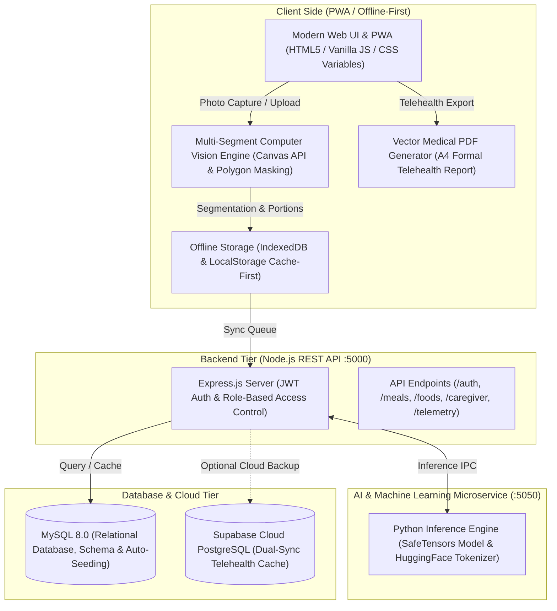

<div align="center">

```text
███╗   ██╗██╗   ██╗████████╗██████╗ ██╗██╗   ██╗██╗███████╗██╗ ██████╗ ███╗   ██╗     █████╗ ██╗
████╗  ██║██║   ██║╚══██╔══╝██╔══██╗██║██║   ██║██║██╔════╝██║██╔═══██╗████╗  ██║    ██╔══██╗██║
██╔██╗ ██║██║   ██║   ██║   ██████╔╝██║██║   ██║██║███████╗██║██║   ██║██╔██╗ ██║    ███████║██║
██║╚██╗██║██║   ██║   ██║   ██╔══██╗██║╚██╗ ██╔╝██║╚════██║██║██║   ██║██║╚██╗██║    ██╔══██║██║
██║ ╚████║╚██████╔╝   ██║   ██║  ██║██║ ╚████╔╝ ██║███████║██║╚██████╔╝██║ ╚████║    ██║  ██║██║
╚═╝  ╚═══╝ ╚═════╝    ╚═╝   ╚═╝  ╚═╝╚═╝  ╚═══╝  ╚═╝╚══════╝╚═╝ ╚═════╝ ╚═╝  ╚═══╝    ╚═╝  ╚═╝╚═╝
```

### 🥗 **AI-Powered Precision Clinical Nutrition & Post-Operative Telehealth Platform (ERAS Protocol)**

[](https://syifamojocanggih-hash.github.io/Nutrivision_AI/)
[](https://syifamojocanggih-hash.github.io/Nutrivision_AI/)
[](https://nodejs.org/)
[](https://mysql.com)
[](https://huggingface.co/)
[](https://supabase.com)
[](https://syifamojocanggih-hash.github.io/Nutrivision_AI/)
[](https://syifamojocanggih-hash.github.io/Nutrivision_AI/)

<br>

🌐 **Live Application Demo:**  
👉 **[https://syifamojocanggih-hash.github.io/Nutrivision_AI/](https://syifamojocanggih-hash.github.io/Nutrivision_AI/)**

[Overview](#-overview) • [Key Features](#-key-features) • [Architecture](#-system-architecture) • [Demo Credentials](#-evaluator--demo-accounts-rbac) • [Quick Start](#-quick-start--local-setup) • [API Specs](#-rest-api-specification) • [Clinical Evidence](#-clinical-evidence--standards)

---

</div>

## 📖 Overview

**NutriVision AI** is a clinical-grade web platform and **Progressive Web App (PWA)** built on the **Enhanced Recovery After Surgery (ERAS)** surgical protocol. It merges **multi-segment Computer Vision AI**, an **indigenous superfood composition database (TKPI Kemenkes RI)**, and **telehealth decision-support tools** to accelerate wound healing and tissue regeneration.

### Why NutriVision AI?
* **Clinical Problem:** Up to **40% of surgical patients suffer from post-operative hypoalbuminemia and malnutrition**, which increases wound dehiscence rates by 3x and prolongs hospitalization.
* **Financial Burden:** Commercial clinical nutritional shakes and imported whey isolates are costly for everyday families (Rp80,000–Rp150,000/day).
* **The NutriVision AI Solution:** Leveraging local high-albumin superfoods—such as Snakehead Fish (*Channa striata*), Tempeh, Egg whites, and Water Spinach—patients can meet a strict 80–120g protein target for as low as **Rp25,000/day**, automatically verified via computer vision plate scanning.

---

## 🌟 Key Features

| Category | Feature | Description & Clinical Utility |
| :--- | :--- | :--- |
| 👁️ **Computer Vision** | **Multi-Segment Plate AI** | Automatically identifies dishes on a plate, generates color-coded polygon masks, estimates portion grammage, and calculates real-time Protein, Carbohydrates, Fat, and Calories. |
| 🎯 **Precision Nutrition** | **Dynamic Macro Rings (ERAS)** | Real-time recovery dials tailored to post-op phases: **Phase 1 (Acute/Anti-Inflammatory)**, **Phase 2 (Proliferation & Albumin Synthesis)**, and **Phase 3 (Remodeling & Physical Therapy)**. |
| 📄 **Clinical Telehealth** | **1-Click Official Medical PDF** | Client-side vector rendering of formal A4 medical reports complete with 7-day adherence charts, active symptoms, clinical targets, and physician/caregiver signature spaces. |
| 🥣 **Symptom Engine** | **Symptom-Aware Texture Filter** | Dynamically adapts recipes for post-anesthetic complications: **Dysphagia (pureed/soft)**, **Nausea (clear broth, ginger)**, **Constipation (soluble fiber)**, and **Low Appetite (dense small meals)**. |
| 🍱 **Meal Planner** | **Dual-Mode Diet Engine** | Toggles between **Optimal/Clinical Grade** (wild fish, lean meats) and **Budget-Friendly** (tempeh, boiled eggs, local mackerel) without compromising biological recovery targets. |
| 🩺 **Clinical Portal** | **Doctor DPJP Dashboard** | Specialist view to supervise outpatient recovery, review serum albumin trends, inspect scanned food logs, and issue telehealth diet adjustments. |
| 👨‍👩‍👧 **Family Caregiver** | **Tokenized Caregiver Portal** | Secure, read-only encrypted link allowing family members to monitor elderly or bedridden patient nutrition remotely without risking accidental data modifications. |
| 🔔 **Proactive Care** | **Smart Clinical Notifications** | Automated notifications for morning protein targets, wound hydration reminders, and clinical milestone achievements. |
| ♿ **Accessibility** | **Senior-Friendly & WCAG 2.1 AAA** | 3-tier font enlargement (Standard, Medium, Large), ultra-high contrast black/white theme (>13:1 contrast ratio), thumb-friendly layout, and 100% offline-first PWA caching. |

---

## 🏗️ System Architecture



---

## 🔑 Evaluator & Demo Accounts (RBAC)

The application employs a **Unified Single Sign-On (SSO)** architecture. You do not need to hunt for hidden switches—simply sign in using any of the seeded credentials below, and the system will automatically route you to the corresponding role dashboard:

| Role | Account Name | Email | Password | Accessible Dashboard & Capabilities |
| :--- | :--- | :--- | :--- | :--- |
| **Post-Op Patient** | Siti Rahma / Rangga | `pasien@nutrivision.id` | `pasien123` | **Patient Dashboard** (Phase 2 Proliferation, Albumin Macro Rings, AI Food Plate Scanner) |
| **Physical Therapy** | Siti Rahmawati / Ahmad | `siti@nutrivision.id` *(or `ahmad@nutrivision.id`)* | `siti123` *(or `ahmad123`)* | **Patient Dashboard** (ACL Tear Rehab, Low-Budget TKPI Meal Planner) |
| **Clinical Doctor (DPJP)** | dr. Hendra Kurniawan, Sp.GK | `dokter@nutrivision.id` *(or `hendra@nutrivision.id`)* | `dokter123` | **Doctor Clinical Portal** (Patient Supervision, Serum Albumin Lab Evaluation, Medical PDF Verification) |
| **Family Caregiver** | Ratna Dewi / Rina | `caregiver@nutrivision.id` | `caregiver123` | **Caregiver Portal** (Patient Compliance Tracking, Dietary Restrictions, Home Care Tips) |
| **Super Administrator** | Administrator NutriVision | `admin@nutrivision.id` | `admin123` | **Admin Command Center** (Audit Trail Logs, Cloud Synchronization, Database Management) |

> 💡 **Pre-seeded Caregiver Token:** `demo-caregiver-token-siti` (allows read-only patient tracking for Siti Rahma).

---

## 🚀 Quick Start & Local Setup

### Prerequisites
* **Node.js** v18.0 or higher
* **MySQL** 8.0+ (via Laragon, XAMPP, or standalone service on port `3306`)
* **Python** 3.9+ *(optional, required only for local `.safetensors` microservice)*

---

### Option A: 1-Click Master Launcher (Windows)

The repository includes a battle-tested master batch launcher that automatically checks MySQL, starts the Python AI microservice, spins up the Node.js REST API, and executes system health verification:

1. Clone this repository:
   ```bash
   git clone https://github.com/syifamojocanggih-hash/Nutrivision_AI.git
   cd "Nutrivision AI"
   ```
2. Double-click **`start_all_backend.bat`** (or run in Command Prompt):
   ```cmd
   start_all_backend.bat
   ```
3. Open your browser and navigate to:
   ```text
   http://localhost:5000
   ```

---

### Option B: Manual Step-by-Step Installation

#### 1. Backend Server Setup
```bash
cd server
npm install
```

#### 2. Configure Environment (`server/.env`)
Ensure your MySQL database service is running on port 3306, then configure `server/.env`:
```env
PORT=5000
DB_HOST=127.0.0.1
DB_PORT=3306
DB_USER=root
DB_PASSWORD=
DB_NAME=nutrivision_ai
JWT_SECRET=nutrivision_jwt_secret_key_gayatama5_production_grade_clinical_secure
NODE_ENV=development
```
*(The MySQL database `nutrivision_ai`, relational tables, and clinical seeds will be created and populated automatically on first run).*

#### 3. Start Backend & AI Services
```bash
# Terminal 1: Python AI Inference Service (Port 5050)
python server/ai_service.py 5050

# Terminal 2: Node.js Express REST API (Port 5000)
npm start
```

#### 4. Run Automated Test Suite
To verify that all 49 endpoints (Auth, Meals, Foods, Caregiver, Telemetry, and Safetensors AI) are operating properly:
```bash
npm test
```

---

## 📡 REST API Specification

| Method | Endpoint | Description | Auth Required |
| :--- | :--- | :--- | :---: |
| `GET` | `/api/health` | Server uptime, port status, and database latency | No |
| `POST` | `/api/auth/register` | Register new clinical patient and compute ERAS targets | No |
| `POST` | `/api/auth/login` | Authenticate user (Unified SSO) and issue JWT token | No |
| `GET` | `/api/auth/me` | Fetch authenticated user profile & nutritional targets | **Yes** |
| `PUT` | `/api/auth/profile` | Update anthropometrics, recovery phase, and restrictions | **Yes** |
| `GET` | `/api/meals` | Retrieve patient historical meal logs and macronutrient breakdowns | **Yes** |
| `POST` | `/api/meals` | Log a meal with segmented polygon items, protein, and calories | **Yes** |
| `DELETE` | `/api/meals/:id` | Remove a specific meal log | **Yes** |
| `GET` | `/api/meals/weekly-stats` | 7-day adherence aggregate score and compliance percentages | **Yes** |
| `GET` | `/api/foods` | Query Indonesian food composition catalog (`?q=`, `?category=`, `?symptom=`) | No |
| `GET` | `/api/foods/:id` | Detailed micronutrients (Albumin, Zinc, Iron, Vitamin C) | No |
| `POST` | `/api/cv/analyze` | Multi-segment computer vision plate analysis (`multipart/form-data`) | No |
| `POST` | `/api/caregiver/generate-token` | Generate encrypted read-only telehealth monitoring token | **Yes** |
| `GET` | `/api/caregiver/view/:token` | Read-only patient recovery view for family caregivers | No |
| `GET` | `/api/community/posts` | Clinical community feed and peer recovery stories | No |
| `POST` | `/api/community/posts` | Share a recovery milestone or high-protein recipe | **Yes** |
| `GET` | `/api/telemetry/stats` | System telemetry metrics, active sessions, and throughput | **Admin** |
| `GET` | `/api/telemetry/audit-logs` | Comprehensive security audit trail | **Admin** |
| `GET` | `/api/notifications` | Fetch clinical notifications and reminder alerts | **Yes** |

---

## 📁 Repository Structure

```text
Nutrivision AI/
├── index.html                  # Main PWA application entry point
├── manifest.json               # Web App Manifest (PWA installable metadata)
├── sw.js                       # Service Worker (offline cache-first engine)
├── start_all_backend.bat       # 1-Click launcher for MySQL, Node.js & Python AI
├── model.safetensors           # Local HuggingFace Safetensors AI model weights
├── tokenizer.json              # Tokenizer vocabulary configuration
│
├── css/                        # Modular CSS Design System (Organic Matcha Theme)
│   ├── base.css                # Typography, CSS variables, and layout resets
│   ├── components.css          # Cards, modals, buttons, and custom inputs
│   ├── layout.css              # Navigation bars, grids, and responsive views
│   ├── doctor.css              # Clinical DPJP portal and patient roster styling
│   └── accessibility.css       # WCAG AAA high-contrast and font scaler styles
│
├── js/                         # Client-Side Application Core
│   ├── app.js                  # Central controller, state management, and UI logic
│   ├── db.js                   # IndexedDB storage and local caching layer
│   ├── api-client.js           # REST API client & Axios/Fetch wrapper
│   ├── cv-engine.js            # Multi-segment Canvas computer vision pipeline
│   ├── planner.js              # Dual-mode ERAS meal planning algorithms
│   ├── progress.js             # Macro rings, 7-day adherence tracker & PDF engine
│   ├── caregiver.js            # Tokenized caregiver sharing controller
│   └── supabase-config.js      # Optional Supabase cloud synchronization config
│
├── server/                     # Production REST API Backend
│   ├── server.js               # Node.js Express server entry point
│   ├── ai_service.py           # Python Safetensors microservice (:5050)
│   ├── verify_system.js        # Automated health & diagnostic audit runner
│   ├── database/               # MySQL schema and initial seeder
│   │   ├── connection.js       # MySQL connection pool (mysql2/promise)
│   │   ├── schema.sql          # Relational DDL tables & indexes
│   │   └── seed.js             # Initial clinical users, foods, and meals seeder
│   ├── routes/                 # REST API route handlers
│   └── test/                   # Automated API test suite (49 test cases)
│       └── api.test.js
│
└── images/                     # Graphic assets, local food database imagery
```

---

## 🔬 Clinical Evidence & Standards

NutriVision AI is built upon established evidence-based clinical protocols:
1. **ERAS® Society Guidelines:** Enhanced Recovery After Surgery multimodal perioperative care pathways, highlighting early enteral nutrition and 1.5–2.0 g/kg/day protein intake.
2. **TKPI (Tabel Komposisi Pangan Indonesia):** Official food composition values formulated by the Ministry of Health (Kemenkes RI) and Bappenas.
3. **Snakehead Fish (*Channa striata*) Research:** Peer-reviewed clinical studies confirming concentrated 2.1–3.0 g/100g bioactive albumin levels promoting accelerated tissue re-epithelialization and oncotic pressure stabilization.
4. **WCAG 2.1 AAA Standard:** Verified visual contrast ratios exceeding 13:1 on interactive primary elements, with dedicated auditory and visual screen accommodations for elderly post-op patients.

---

<div align="center">

Built with care for surgical recovery and nutritional autonomy across Indonesia 🇮🇩  
**NutriVision AI — Smart Nutrition, Faster Recovery.**

</div>
