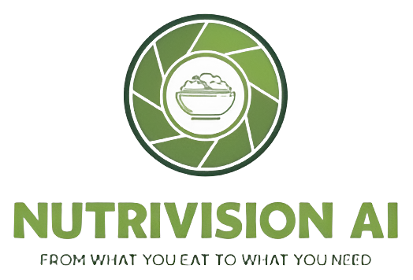
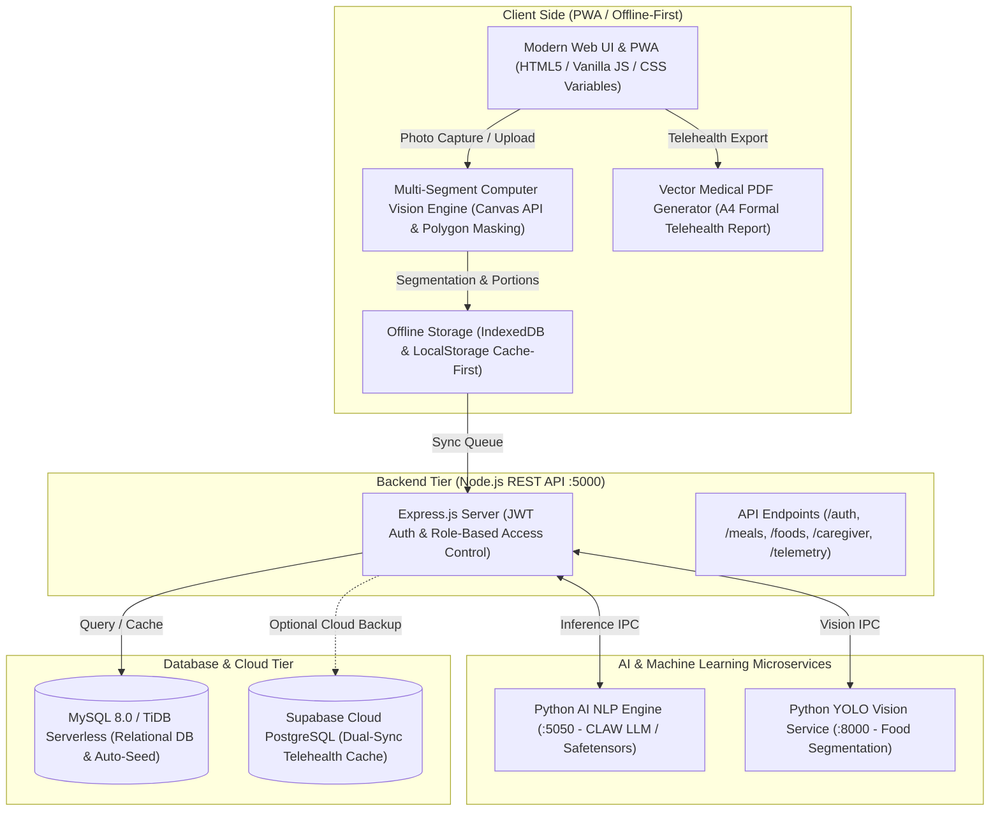

<div align="center">



### 🥗 **NUTRIVISION AI**
*From What You Eat to What You Need*
#### **Precision Clinical Nutrition &amp; Post-Operative Telehealth Platform (ERAS Protocol)**

[](https://syifamojocanggih-hash.github.io/Nutrivision_AI/)
[](https://syifamojocanggih-hash.github.io/Nutrivision_AI/)
[](https://nodejs.org/)
[](https://mysql.com)
[](https://huggingface.co/)
[](https://supabase.com)
[](https://syifamojocanggih-hash.github.io/Nutrivision_AI/)
[](https://syifamojocanggih-hash.github.io/Nutrivision_AI/)

<br>

� **Live Application Demo:**  
👉 **[https://syifamojocanggih-hash.github.io/Nutrivision_AI/](https://syifamojocanggih-hash.github.io/Nutrivision_AI/)**

<br>

[Overview](#-overview) • [Key Features](#-key-features) • [Architecture](#-system-architecture) • [Demo Credentials](#-evaluator--demo-accounts-rbac) • [Installation Guide](#-installation--setup-guide) • [API Specs](#-rest-api-specification) • [Clinical Evidence](#-clinical-evidence--standards)

---

</div>

## 📖 Overview

**NutriVision AI** is a clinical-grade web platform and **Progressive Web App (PWA)** built on the **Enhanced Recovery After Surgery (ERAS)** surgical protocol. It merges **multi-segment Computer Vision AI**, an **indigenous superfood composition database (TKPI Kemenkes RI)**, and **telehealth decision-support tools** to accelerate wound healing and tissue regeneration.

### Why NutriVision AI?
* **Clinical Problem:** Up to **40% of surgical patients suffer from post-operative hypoalbuminemia and malnutrition**, which increases wound dehiscence rates by 3x and prolongs hospitalization.
* **Financial Burden:** Commercial clinical nutritional shakes and imported whey isolates are costly for everyday families (Rp80,000–Rp150,000/day).
* **The NutriVision AI Solution:** Leveraging local high-albumin superfoods—such as Snakehead Fish (*Channa striata*), Tempeh, Egg whites, and Water Spinach—patients can meet a strict 80–120g protein target for as low as **Rp25,000/day**, automatically verified via computer vision plate scanning.

---

## 🌟 Key Features

| Category | Feature | Description & Clinical Utility |
| :--- | :--- | :--- |
| �� **Computer Vision** | **Multi-Segment Plate AI** | Automatically identifies dishes on a plate, generates color-coded polygon masks, estimates portion grammage, and calculates real-time Protein, Carbohydrates, Fat, and Calories. |
| � **Precision Nutrition** | **Dynamic Macro Rings (ERAS)** | Real-time recovery dials tailored to post-op phases: **Phase 1 (Acute/Anti-Inflammatory)**, **Phase 2 (Proliferation & Albumin Synthesis)**, and **Phase 3 (Remodeling & Physical Therapy)**. |
| 📄 **Clinical Telehealth** | **1-Click Official Medical PDF** | Client-side vector rendering of formal A4 medical reports complete with 7-day adherence charts, active symptoms, clinical targets, and physician/caregiver signature spaces. |
| 🥣 **Symptom Engine** | **Symptom-Aware Texture Filter** | Dynamically adapts recipes for post-anesthetic complications: **Dysphagia (pureed/soft)**, **Nausea (clear broth, ginger)**, **Constipation (soluble fiber)**, and **Low Appetite (dense small meals)**. |
| � **Meal Planner** | **Dual-Mode Diet Engine** | Toggles between **Optimal/Clinical Grade** (wild fish, lean meats) and **Budget-Friendly** (tempeh, boiled eggs, local mackerel) without compromising biological recovery targets. |
| 👨�👩�👧 **Family Caregiver** | **Tokenized Caregiver Portal** | Secure, read-only encrypted link allowing family members to monitor elderly or bedridden patient nutrition remotely without risking accidental data modifications. |
| 🔔 **Proactive Care** | **Smart Clinical Notifications** | Automated notifications for morning protein targets, wound hydration reminders, and clinical milestone achievements. |
| ♿ **Accessibility** | **Senior-Friendly & WCAG 2.1 AAA** | 3-tier font enlargement (Standard, Medium, Large), ultra-high contrast black/white theme (>13:1 contrast ratio), thumb-friendly layout, and 100% offline-first PWA caching. |

---

## �� System Architecture



---

## 🔑 Evaluator & Demo Accounts (RBAC)

The application employs a **Unified Single Sign-On (SSO)** architecture. You do not need to hunt for hidden switches—simply sign in using any of the seeded credentials below, and the system will automatically route you to the corresponding role dashboard:

| Role | Account Name | Email | Password | Accessible Dashboard & Capabilities |
| :--- | :--- | :--- | :--- | :--- |
| **Post-Op Patient** | Siti Rahma / Rangga | `pasien@nutrivision.id` | `pasien123` | **Patient Dashboard** (Phase 2 Proliferation, Albumin Macro Rings, AI Food Plate Scanner) |
| **Physical Therapy** | Siti Rahmawati / Ahmad | `siti@nutrivision.id` *(or `ahmad@nutrivision.id`)* | `siti123` *(or `ahmad123`)* | **Patient Dashboard** (ACL Tear Rehab, Low-Budget TKPI Meal Planner) |
| **Family Caregiver** | Ratna Dewi / Rina | `caregiver@nutrivision.id` | `caregiver123` | **Caregiver Portal** (Patient Compliance Tracking, Dietary Restrictions, Home Care Tips) |
| **Super Administrator** | Administrator NutriVision | `admin@nutrivision.id` | `admin123` | **Admin Command Center** (Audit Trail Logs, Cloud Synchronization, Database Management) |

> 💡 **Pre-seeded Caregiver Token:** `demo-caregiver-token-siti` (allows read-only patient tracking for Siti Rahma).

---

## 💻 Installation & Setup Guide

This guide provides comprehensive instructions for deploying NutriVision AI locally on **Windows**, **macOS**, and **Linux**, or in containerized environments.

### 📋 Prerequisites & System Requirements

Before getting started, ensure the following software is installed on your machine:

| Component | Minimum Version | Recommended | Notes / Download Link |
| :--- | :--- | :--- | :--- |
| **Node.js** | `v18.0.0+` | `v20.x LTS` | [nodejs.org](https://nodejs.org/) (includes `npm`) |
| **Python** | `3.9.x` | `3.10.x` or `3.11.x` | [python.org](https://www.python.org/) (for AI Vision & NLP microservices) |
| **Database** | **MySQL 8.0+** or **TiDB Serverless** | MySQL 8.0+ (Port 3306) | Via XAMPP, Laragon, Docker, or [TiDB Cloud](https://tidbcloud.com) |
| **Git** | `v2.x+` | Latest | [git-scm.com](https://git-scm.com/) |

---

### âš¡ Method 1: One-Click Master Launcher (Recommended)

NutriVision AI includes automated master launcher scripts that check database connectivity, initialize microservices, start the Node.js API, run system diagnostics, and serve the frontend web client.

#### On macOS / Linux:
```bash
# 1. Clone the repository
git clone https://github.com/syifamojocanggih-hash/Nutrivision_AI.git
cd Nutrivision_AI

# 2. Grant execution permission & start all backend services
chmod +x start_all_backend.sh
./start_all_backend.sh
```

#### On Windows:
```cmd
# 1. Clone the repository
git clone https://github.com/syifamojocanggih-hash/Nutrivision_AI.git
cd Nutrivision_AI

# 2. Run the master launcher batch script (or double-click start_all_backend.bat)
start_all_backend.bat
```

> � Once launched, open your browser and navigate to: **`http://localhost:5000`**

---

### 🛠� Method 2: Manual Step-by-Step Installation

If you prefer to configure and run each microservice individually:

#### Step 1: Clone Repository
```bash
git clone https://github.com/syifamojocanggih-hash/Nutrivision_AI.git
cd Nutrivision_AI
```

#### Step 2: Configure Environment Variables
Copy or create the `.env` file inside the `server/` directory:
```bash
cp server/.env.example server/.env
```
Edit `server/.env` to match your database credentials:
```env
PORT=5000
DB_HOST=127.0.0.1
DB_PORT=3306
DB_USER=root
DB_PASSWORD=
DB_NAME=nutrivision_ai
JWT_SECRET=nutrivision-secret-clinical-key-2026
PYTHON_AI_URL=http://127.0.0.1:5050
VISION_AI_URL=http://127.0.0.1:8000
NODE_ENV=development
```
> 💡 *Note: The database `nutrivision_ai`, tables, and initial clinical demo seeds are generated automatically when the Node.js server starts for the first time.*

#### Step 3: Install & Start Node.js REST API Backend
```bash
cd server
npm install
npm start
# Or for live-reload development mode:
# npm run dev
```
*The Express REST API server will run on port `5000` and automatically serve the frontend client.*

#### Step 4: Setup & Start Python YOLO Vision Microservice (Port 8000)
In a new terminal window:
```bash
cd vision

# Create and activate Python virtual environment
python3 -m venv venv
# On macOS/Linux:
source venv/bin/activate
# On Windows:
# venv\Scripts\activate

# Install dependencies (FastAPI, PyTorch CPU, Ultralytics YOLO)
pip install -r requirements.txt

# Start the Vision microservice
uvicorn main:app --host 0.0.0.0 --port 8000 --reload
```

#### Step 5: Setup & Start Python AI NLP / Safetensors Microservice (Port 5050)
In another terminal window:
```bash
cd nlp

# Create and activate virtual environment (or reuse vision venv)
python3 -m venv venv
# On macOS/Linux:
source venv/bin/activate
# On Windows:
# venv\Scripts\activate

# Install NLP dependencies
pip install -r requirements.txt

# Start the NLP & Safetensors classification service
python main.py 5050
```

#### Step 6: Access the Web Application
Open your browser and navigate to:
* � **Frontend Web App & PWA:** `http://localhost:5000`
* 🩺 **Backend API Health Check:** `http://localhost:5000/api/health`
* �� **YOLO Vision API Docs:** `http://localhost:8000/docs`
* 🧠 **Python AI NLP Health:** `http://localhost:5050/health`

---

### � Method 3: Docker Deployment (Vision Microservice)

The YOLO Vision service can also be containerized using the provided `Dockerfile`:
```bash
cd vision
# Build Docker image
docker build -t nutrivision-vision .

# Run Docker container
docker run -d -p 8000:8000 --name nutrivision-vision-container nutrivision-vision
```

---

### 🧪 Automated System Diagnostic & Verification

To verify that all database tables, initial seeds, AI endpoints, and REST routes are functioning properly:
```bash
# Run system diagnostic audit
node server/verify_system.js

# Run automated API test suite (49 test cases)
cd server
npm test
```

---

### ⚙� Environment Variables Reference

| Variable | Default Value | Description |
| :--- | :--- | :--- |
| `PORT` | `5000` | Port for Node.js Express REST API server |
| `DB_HOST` | `127.0.0.1` | MySQL / TiDB host address |
| `DB_PORT` | `3306` *(or `4000` for TiDB)* | MySQL / TiDB database port |
| `DB_USER` | `root` | Database username |
| `DB_PASSWORD` | *(empty)* | Database password |
| `DB_NAME` | `nutrivision_ai` | Database schema name |
| `TIDB_SSL` | `false` | Set to `true` when using TiDB Cloud SSL certificates |
| `JWT_SECRET` | *(custom string)* | Secret key for signing and verifying JWT session tokens |
| `PYTHON_AI_URL` | `http://127.0.0.1:5050` | Microservice URL for Python AI NLP Safetensors engine |
| `VISION_AI_URL` | `http://127.0.0.1:8000` | Microservice URL for Python FastAPI YOLO Vision engine |
| `NODE_ENV` | `development` | Application environment mode (`development` / `production`) |

---

### � Troubleshooting & FAQ

<details>
<summary><b>1. Error: <code>ECONNREFUSED 127.0.0.1:3306</code> (Database Connection Failed)</b></summary>
Ensure your MySQL service is running. If using XAMPP or Laragon, open the control panel and start the MySQL module. If using Docker:
<code>docker run -d --name mysql-nutrivision -p 3306:3306 -e MYSQL_ROOT_PASSWORD= -e MYSQL_DATABASE=nutrivision_ai mysql:8.0</code>
</details>

<details>
<summary><b>2. Error: <code>Port 5000 / 8000 / 5050 is already in use</code></b></summary>
Find and terminate the existing process occupying the port:
<ul>
<li><b>macOS/Linux:</b> <code>lsof -ti:5000 | xargs kill -9</code></li>
<li><b>Windows:</b> <code>netstat -ano | findstr :5000</code> followed by <code>taskkill /PID &lt;PID&gt; /F</code></li>
</ul>
</details>

<details>
<summary><b>3. PyTorch installation is slow or fails in <code>vision/</code></b></summary>
Use the lightweight CPU-only PyTorch build specified in <code>vision/requirements.txt</code>:
<code>pip install torch torchvision --index-url https://download.pytorch.org/whl/cpu</code>
</details>

<details>
<summary><b>4. How to use TiDB Cloud Serverless instead of local MySQL?</b></summary>
Set <code>DB_HOST=gateway01.ap-southeast-1.prod.aws.tidbcloud.com</code>, <code>DB_PORT=4000</code>, <code>TIDB_SSL=true</code>, along with your TiDB Cloud username and password in <code>server/.env</code>.
</details>

---

## � Repository Structure

```text
Nutrivision AI/
├── start_all_backend.sh        # 1-Click launcher for macOS / Linux
├── start_all_backend.bat       # 1-Click launcher for Windows
│
├── frontend/                   # Client-Side Progressive Web App (PWA)
│   ├── index.html              # Single Page Application entry point
│   ├── manifest.json           # Web App Manifest (PWA install metadata)
│   ├── sw.js                   # Service Worker (offline cache-first engine)
│   ├── css/                    # Modular CSS Design System (Organic Matcha Theme)
│   │   ├── base.css            # Typography, CSS variables, resets
│   │   ├── components.css      # Cards, modals, buttons, form controls
│   │   ├── layout.css          # Navigation bars, grid layouts, responsive views
│   │   ├── doctor.css          # Clinical DPJP portal and patient roster styling
│   │   └── accessibility.css   # WCAG AAA high-contrast and font scaler styles
│   ├── js/                     # Client Application Logic
│   │   ├── app.js              # Central application controller & state management
│   │   ├── db.js               # IndexedDB storage and local caching layer
│   │   ├── api-client.js       # REST API client & Axios/Fetch wrapper
│   │   ├── cv-engine.js        # Multi-segment Canvas computer vision pipeline
│   │   ├── planner.js          # Dual-mode ERAS meal planning algorithms
│   │   ├── progress.js         # Macro rings, 7-day adherence tracker & PDF engine
│   │   ├── caregiver.js        # Tokenized caregiver sharing controller
│   │   ├── i18n.js             # Bilingual Internationalization (ID/EN)
│   │   └── supabase-config.js  # Optional Supabase cloud sync config
│   ├── icons/                  # PWA and application icons
│   └── images/                 # Food assets and clinical graphic illustrations
│
├── server/                     # Production Node.js REST API Backend
│   ├── server.js               # Express server entry point & static frontend server
│   ├── verify_system.js        # Automated health & diagnostic audit runner
│   ├── database/               # Relational Database Layer
│   │   ├── connection.js       # MySQL connection pool (mysql2/promise)
│   │   ├── schema.sql          # Relational DDL tables & indexes
│   │   └── seed.js             # Initial clinical users, foods, and meals seeder
│   ├── middleware/             # Auth JWT & Role-Based Access Control middleware
│   ├── routes/                 # REST API route endpoints
│   └── test/                   # Automated API test suite (49 test cases)
│       └── api.test.js
│
├── vision/                     # Python YOLO Food Segmentation Microservice (:8000)
│   ├── main.py                 # FastAPI application & YOLO inference endpoints
│   ├── best.pt                 # Pre-trained YOLO model weights for food segmentation
│   ├── requirements.txt        # Vision microservice Python dependencies
│   └── Dockerfile              # Containerization definition for Vision service
│
└── nlp/                        # Python AI NLP & Safetensors Microservice (:5050)
    ├── main.py                 # NLP classification service & LLM decision support
    ├── model.safetensors       # Local SafeTensors model weights
    ├── tokenizer.json          # HuggingFace Tokenizer vocabulary configuration
    └── requirements.txt        # NLP microservice Python dependencies
```

---

## 🔬 Clinical Evidence & Standards”── seed.js             # Initial clinical users, foods, and meals seeder
│   ├── routes/                 # REST API route handlers
│   └── test/                   # Automated API test suite (49 test cases)
│       └── api.test.js
│
└── images/                     # Graphic assets, local food database imagery
```

---

## 🔬 Clinical Evidence & Standards

NutriVision AI is built upon established evidence-based clinical protocols:
1. **ERAS® Society Guidelines:** Enhanced Recovery After Surgery multimodal perioperative care pathways, highlighting early enteral nutrition and 1.5–2.0 g/kg/day protein intake.
2. **TKPI (Tabel Komposisi Pangan Indonesia):** Official food composition values formulated by the Ministry of Health (Kemenkes RI) and Bappenas.
3. **Snakehead Fish (*Channa striata*) Research:** Peer-reviewed clinical studies confirming concentrated 2.1–3.0 g/100g bioactive albumin levels promoting accelerated tissue re-epithelialization and oncotic pressure stabilization.
4. **WCAG 2.1 AAA Standard:** Verified visual contrast ratios exceeding 13:1 on interactive primary elements, with dedicated auditory and visual screen accommodations for elderly post-op patients.

---

<div align="center">

Built with care for surgical recovery and nutritional autonomy across Indonesia 🇮🇩  
**NutriVision AI — Smart Nutrition, Faster Recovery.**

</div>
